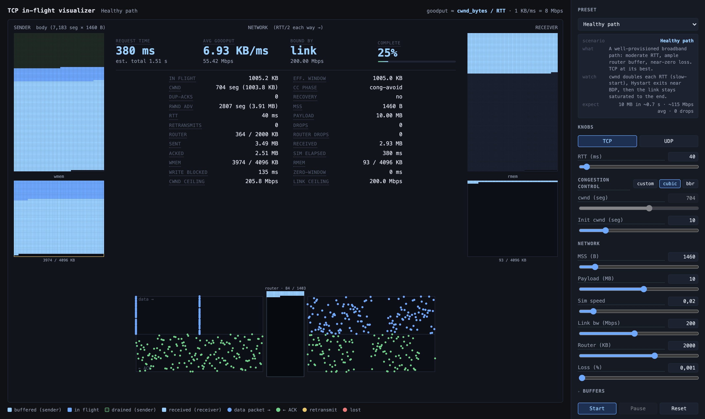

# TCP in-flight visualizer

An interactive, in-browser simulator of **TCP behavior on a single bulk transfer**. Watch every byte
of a request leave the sender, traverse the network, queue at the bottleneck router, and arrive at
the receiver — with the congestion window, kernel buffers, ACK clock, and loss recovery all animated
in real time.



## Why

TCP's congestion control decides the real-world throughput and latency of almost everything on the
internet, but its dynamics — slow-start, cwnd growth, queue overflow, fast retransmit, flow control —
are usually invisible. This tool makes them visible. It is built for developers debugging transfer
performance, students learning networking, and anyone who has ever asked "why is this upload slow
when the link is fast?"

The simulator models:

- **TCP Cubic** (Linux default since ~2008): slow-start, Hystart, fast retransmit, NewReno-style
  fast recovery, RTO.
- **TCP BBR** (Google, 2016): BtlBw/RTprop estimators, paced sends, the full
  STARTUP → DRAIN → PROBE_BW → PROBE_RTT state machine.
- **Bottleneck queue dynamics**: packets dwell in a finite router buffer; overflow drops them.
- **Kernel buffers and flow control**: send/receive buffers (wmem/rmem), the recv window (rwnd), zero-window stalls,
  app-side read/write pacing.
- **UDP mode**: no ACKs, no retransmits, no flow control — for contrast.

## Quick start

No build step. Serve the directory and open the page:

```bash
npm run serve            # python3 -m http.server 8080
open http://localhost:8080/tcp-inflight.html
```

Pick a preset, hit **Start**, and adjust the sim speed slider to taste (default is 50× slow-motion
so you can watch individual packets).

## Scenario presets

Each preset is a self-contained lesson with calibrated knobs:

| Preset | The lesson | Expected outcome |
|---|---|---|
| **Healthy path** | What TCP looks like when everything is right | 10 MB in ~0.7 s, no drops |
| **Cwnd buildup (long fat pipe)** | Cold connections waste a long ramp-up on high-BDP paths | 20 MB in ~2.0 s on a 300 Mbps link |
| **Good initial cwnd (warm start)** | Same path, cwnd starts at BDP — the ramp disappears | Same 20 MB in ~0.8 s (2.6× faster) |
| **Congestion (shallow buffer)** | Under-buffered bottleneck: drops, sawtooth, low utilization | 5 MB crawls in ~8 s at ~5 Mbps |
| **Bufferbloat (oversized buffer)** | Window ≫ BDP + huge buffer = a standing queue, no signal to slow down | Link saturated but ~450 ms of queue dwell |
| **Lossy link (radio / Wi-Fi)** | Random loss isn't congestion, but Cubic reacts as if it were | Cubic: usually ~1 Mbps. Switch to BBR: ~25 Mbps, every time |
| **Slow receiver (flow control)** | The receiver's app, not the network, sets the pace | Goodput pinned at the app read rate |

The most fun comparisons: run **cwnd-buildup** then **warm-start**, and run **lossy** with cubic
then with bbr.

## Knobs

Everything is adjustable live: RTT, MSS, payload size, link bandwidth, router buffer size, random
loss %, congestion-control algorithm (custom fixed-cwnd / cubic / bbr), initial cwnd, send/receive buffer
sizes, app read/write rates, and a handshake toggle — warm (reused connection, data at t=0) vs cold
(full 3-way handshake: SYN/SYN-ACK animate across the band and the first data packet leaves one full
RTT after start). Hover any knob for an explanation. Everything is
glossaried: click any underlined term, any legend item, or any component on the canvas itself
(body grids, buffer buckets, router queue, network band) to open its definition — and glossary
entries cross-link the terms they mention.

## Programmatic API

The page exposes `window.SimAgent` for scripted experiments — configure runs, execute them
deterministically (no animation) or visually, and read structured results:

```js
SimAgent.applyPreset("lossy");
SimAgent.setCcMode("bbr");
await SimAgent.runToCompletion({ visual: false });
SimAgent.getSummary();   // { elapsed_sim_ms, goodput_Mbps, retransmits_total, ... }
```

See [llms.txt](llms.txt) for the full API reference (state snapshots, 10 Hz traces, discrete
events, artifact capture/replay), and [examples/agent-driver.js](examples/agent-driver.js) for a
Puppeteer script that drives the page end to end.

## CLI

The simulation core is pure JavaScript and also runs in Node:

```bash
node sim-cli.js --preset congestion --seconds 10        # CSV trace + summary
node sim-cli.js --preset lossy --cc bbr --seconds 10
node sim-cli.js --help
```

## Architecture

| File | Role |
|---|---|
| `sim-core.js` | Pure simulation model — state factory, step function, presets. No DOM; runs in Node or browser. |
| `sim-runner.js` | Shared runner — RAF loop (browser) or tight loop (Node); captures 10 Hz samples and events. |
| `sim-agent-api.js` | Exposes `window.SimAgent`. |
| `tcp-inflight.html` | The page: canvas visualization, knobs, glossary. |
| `sim-cli.js` | Node CLI entry point. |

## Deploying

The repo is a static site. On Vercel, no configuration is needed beyond the included `vercel.json`
(routes `/` to the visualizer).

## Fidelity notes

This is a teaching model, not a packet-accurate network emulator. Simplifications worth knowing:
one flow, one bottleneck; Cubic sends are ACK-clocked but unpaced (bursts hit the queue at line
rate, so shallow-buffer scenarios are harsher than reality); Hystart exits slow-start exactly at
BDP; the RTO model is simplified (no exponential backoff); BBR repairs losses (SACK-style: a
segment with 3 ACKed segments above it is retransmitted immediately) but ignores them for rate
control, as real BBRv1 does. The
qualitative dynamics — ramp shapes, sawtooth, standing queues, window stalls — match what you would
see in a real trace.

## License

MIT
